# 3legant - MERN Stack E-Commerce Platform

<div align="center">

[](https://reactjs.org/)
[](https://vitejs.dev/)
[](https://nodejs.org/)
[](https://www.mongodb.com/)
[](https://expressjs.com/)
[](https://tailwindcss.com/)

</div>

## Overview

3legant is a modern e-commerce platform built with the MERN stack, offering a seamless shopping experience with a responsive frontend and a secure backend. It features advanced product filtering, a shopping cart, user authentication, and an admin dashboard for efficient store management.

## Tech Stack

### Frontend

- **React 19** - Latest version with improved performance and features
- **Vite** - Next-generation frontend tooling with instant HMR
- **Tailwind CSS** - Utility-first CSS framework for rapid UI development
- **Radix UI** - Unstyled, accessible components for building high-quality design systems
- **Zustand** - Lightweight state management with minimal boilerplate
- **React Router** - Declarative routing for React applications

### Backend

- **Node.js** - JavaScript runtime for server-side development
- **Express** - Fast, unopinionated web framework for Node.js
- **MongoDB** - NoSQL database for flexible data storage
- **Mongoose** - Elegant MongoDB object modeling
- **JWT** - Secure authentication and authorization
- **Bcrypt** - Password hashing for security

## Features

### Client

- **Responsive Design**

  - Mobile-first approach
  - Fluid layouts and breakpoints
  - Touch-friendly interactions

- **Product Management**

  - Advanced search and filtering
  - Dynamic product categories
  - Real-time inventory updates

- **User Experience**

  - Intuitive shopping cart
  - Wishlist functionality
  - Seamless checkout process
  - Order tracking

- **Authentication**
  - Secure user registration/login
  - Social media authentication
  - Password recovery

### Admin Panel

- **Dashboard Analytics**

  - Sales overview and trends
  - Revenue analytics
  - Customer insights

- **Product Management**

  - Bulk product operations
  - Category management
  - Inventory tracking
  - Image optimization

- **Order Management**

  - Order status updates
  - Payment processing
  - Shipping integration

- **Customer Management**
  - Customer profiles
  - Purchase history
  - Communication tools

### Server

- **API Architecture**

  - RESTful endpoints
  - GraphQL support (planned)
  - API versioning
  - Rate limiting

- **Security**

  - JWT authentication
  - Role-based access control
  - Input validation
  - XSS protection

- **Data Management**
  - CRUD operations
  - Data validation
  - Error handling
  - Logging system

## Project Structure

```bash
3legant/
├── client/                 # React frontend
│   ├── src/
│   │   ├── assets/        # Static resources
│   │   ├── components/    # Reusable UI components
│   │   ├── hooks/         # Custom React hooks
│   │   ├── layout/        # Layout components
│   │   ├── lib/           # Third-party library configs
│   │   ├── pages/         # Page components
│   │   ├── routers/       # Route configurations
│   │   ├── store/         # State management
│   │   └── utils/         # Utility functions
│   ├── public/            # Public assets
│   └── vite.config.js     # Vite configuration
│
└── server/                # Node.js backend
    ├── config/            # App configuration
    ├── controllers/       # Request handlers
    ├── models/            # Database schemas
    ├── routes/            # API routes
    ├── middlewares/       # Custom middlewares
    ├── utils/             # Helper functions
    └── validators/        # Input validation
```

## Environment Configuration

### Client (.env.example)

```env
VITE_API_URL=http://localhost:5000
VITE_STRIPE_PUBLIC_KEY=your_stripe_public_key
VITE_GA_TRACKING_ID=your_ga_tracking_id
```

### Server (.env.example)

```env
PORT=5000
MONGO_URI=mongodb://localhost:27017/3legant
JWT_SECRET=your_jwt_secret_key
JWT_EXPIRE=7d
STRIPE_SECRET_KEY=your_stripe_secret_key
CLOUD_NAME=your_cloudinary_cloud_name
CLOUD_API_KEY=your_cloudinary_api_key
CLOUD_API_SECRET=your_cloudinary_api_secret
```

## Getting Started

### Prerequisites

- Node.js 18+
- npm or yarn
- MongoDB Atlas account or local MongoDB instance
- Git

### Installation

1. Clone the repository:

   ```bash
   git clone https://github.com/Nainee99/3legant-platform.git
   cd 3legant-platform
   ```

2. Install dependencies:

   ```bash
   # Install client dependencies
   cd client
   npm install

   # Install server dependencies
   cd ../server
   npm install
   ```

3. Set up environment variables:
   - Copy `.env.example` to `.env` in both client and server directories
   - Update the variables with your configuration

### Development

1. Start the development servers:

   ```bash
   # Terminal 1: Start client
   cd client
   npm run dev

   # Terminal 2: Start server
   cd server
   npm run dev
   ```

2. Access the application:
   - Frontend: `http://localhost:5173`
   - Backend API: `http://localhost:5000`

## API Documentation

### Authentication

- `POST /api/auth/register` - User registration
- `POST /api/auth/login` - User login
- `POST /api/auth/logout` - User logout
- `GET /api/auth/me` - Get current user

### Products

- `GET /api/products` - Get all products
- `GET /api/products/:id` - Get single product
- `POST /api/products` - Create product (Admin)
- `PUT /api/products/:id` - Update product (Admin)
- `DELETE /api/products/:id` - Delete product (Admin)

### Orders

- `POST /api/orders` - Create order
- `GET /api/orders` - Get user orders
- `GET /api/orders/:id` - Get order details
- `PUT /api/orders/:id` - Update order status (Admin)

## Deployment

### Frontend Deployment

1. Build the frontend:

   ```bash
   cd client
   npm run build
   ```

2. Deploy to hosting platforms:
   - Vercel: Connect repository and deploy
   - Netlify: Upload dist folder or connect repository
   - AWS S3: Upload dist folder and configure CloudFront

### Backend Deployment

1. Prepare for production:

   ```bash
   cd server
   npm run build
   ```

2. Deploy to cloud platforms:
   - Heroku: Connect repository and configure environment
   - AWS EC2: Set up Node.js environment and PM2
   - Digital Ocean: Deploy using App Platform

## Contributing

1. Fork the repository
2. Create your feature branch: `git checkout -b feature/amazing-feature`
3. Commit your changes: `git commit -m 'Add amazing feature'`
4. Push to the branch: `git push origin feature/amazing-feature`
5. Open a pull request

### Development Guidelines

- Follow the existing code style and conventions
- Write meaningful commit messages
- Add appropriate documentation
- Include tests for new features
- Update README.md if needed

## License

This project is licensed under the MIT License - see the [LICENSE](LICENSE) file for details.

## Acknowledgments

- [React Documentation](https://react.dev)
- [Vite](https://vitejs.dev)
- [Tailwind CSS](https://tailwindcss.com)
- [Express.js](https://expressjs.com)
- [MongoDB](https://www.mongodb.com)

## UI Previews

### Auth Page

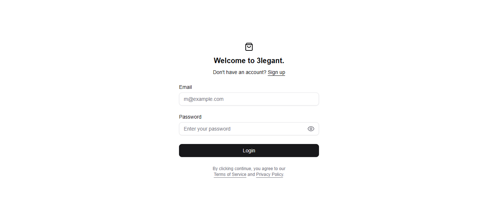

### Landing Page

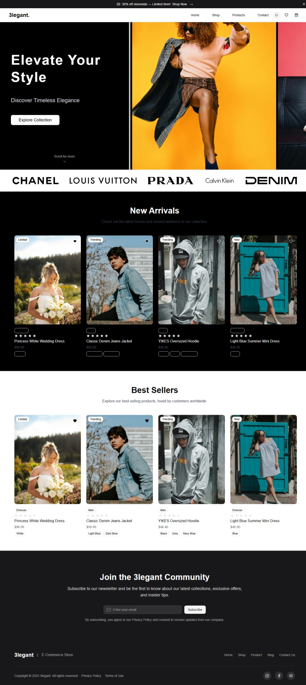

### Product Listing Page

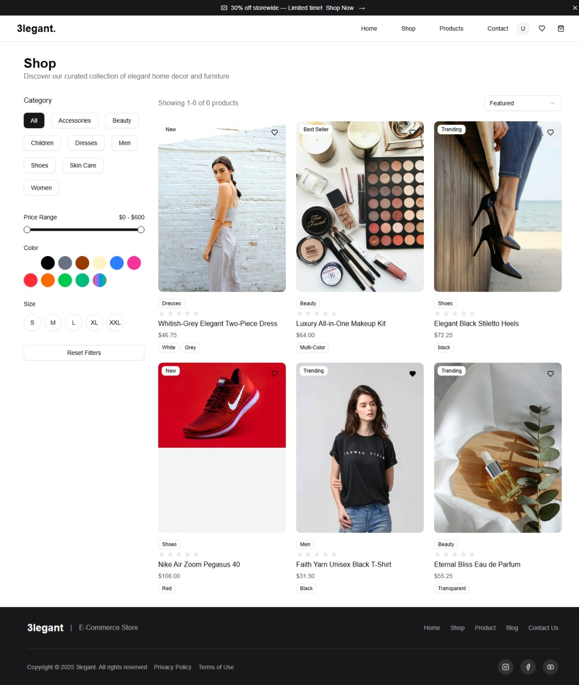

### Product Detail Page

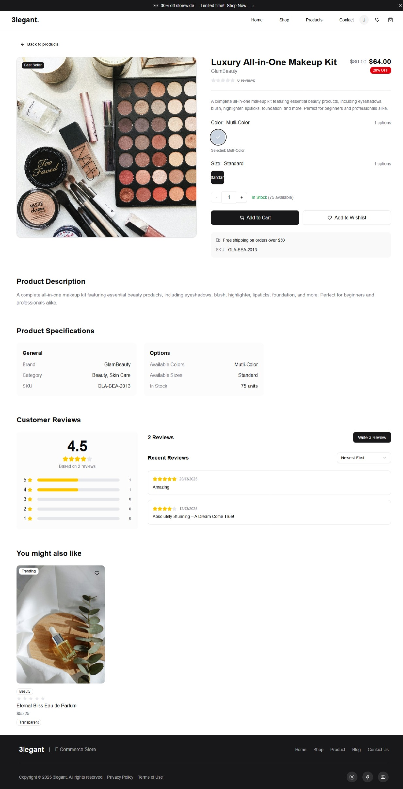

### Cart Page

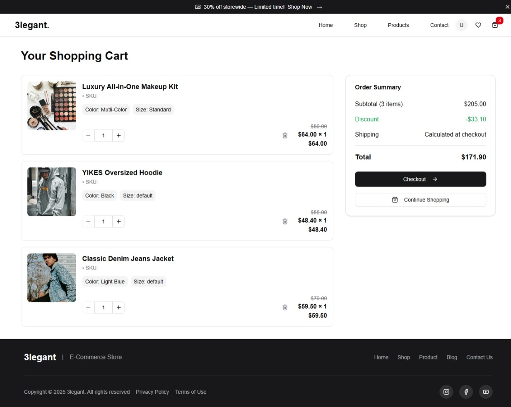

### Checkout Page

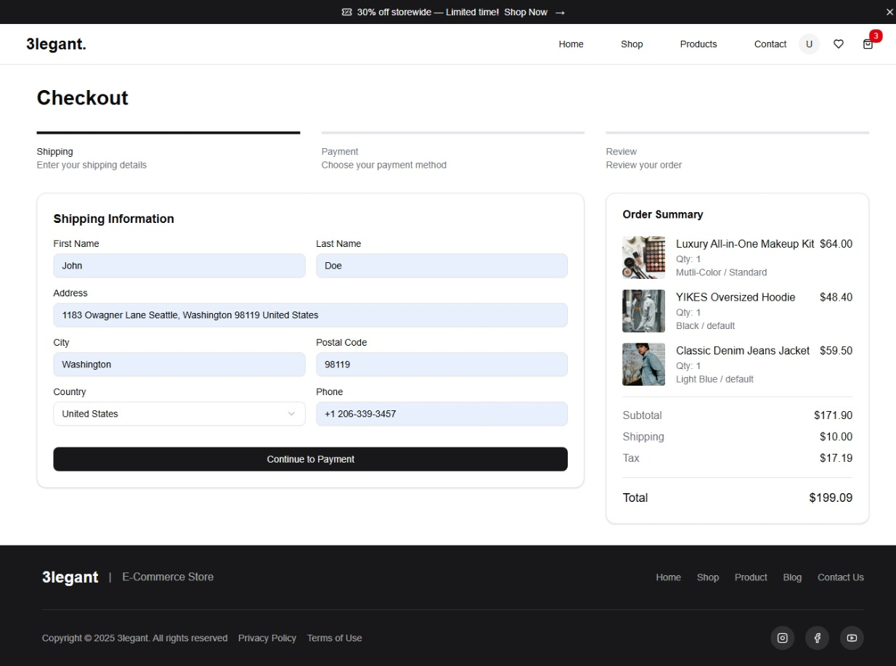

### Order Success Page

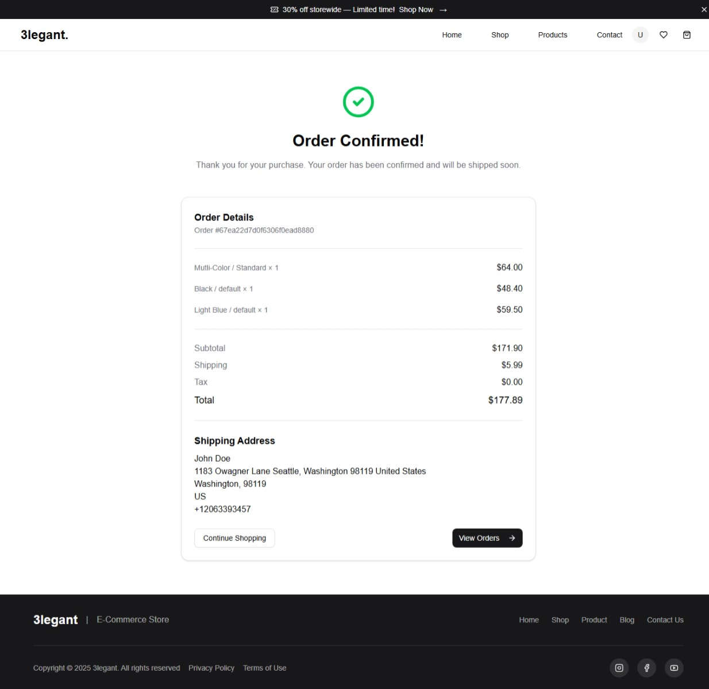

### Wishlist Page

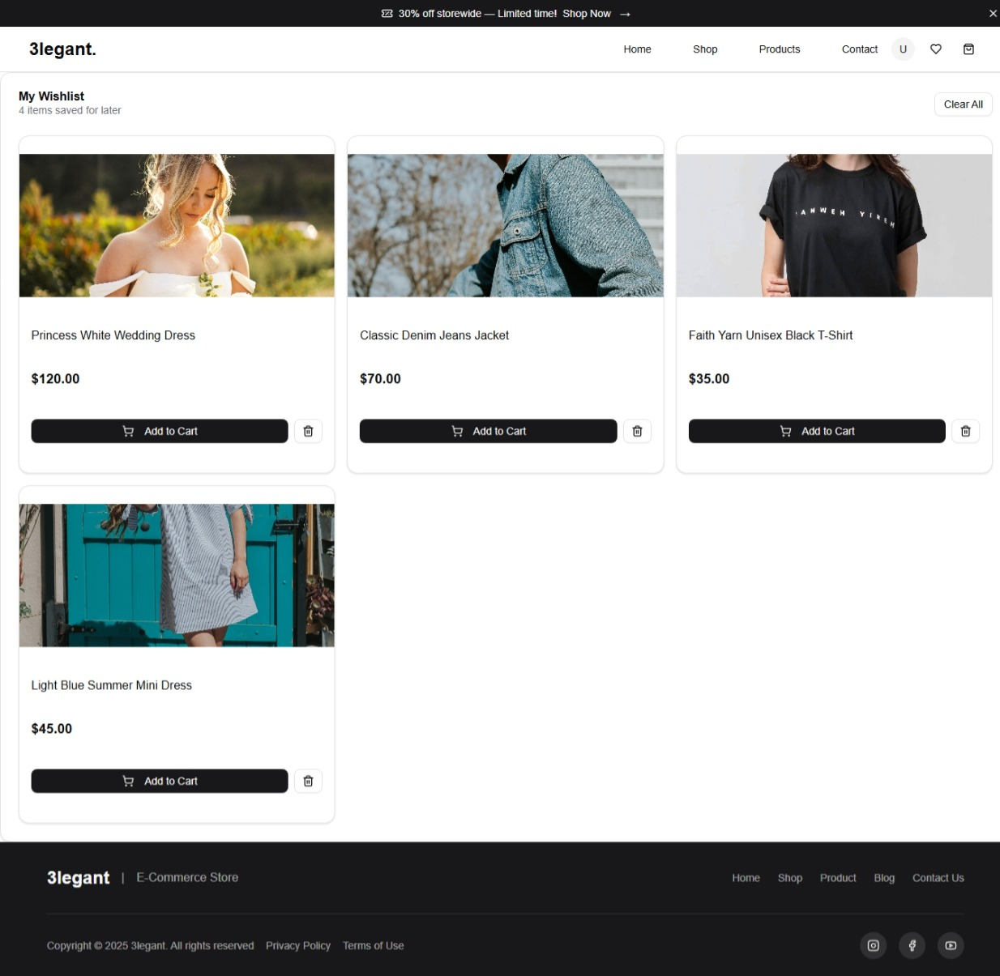

### User Profile Settings

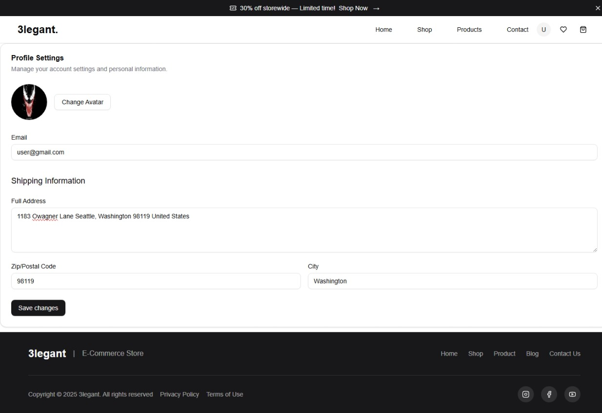

### Admin Dashboard

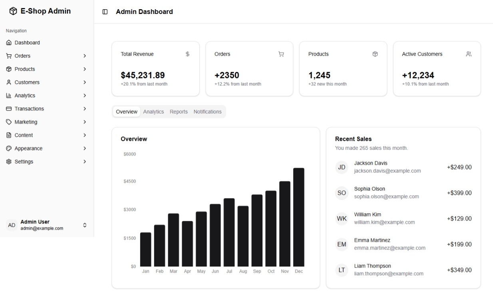

### Admin Products Management

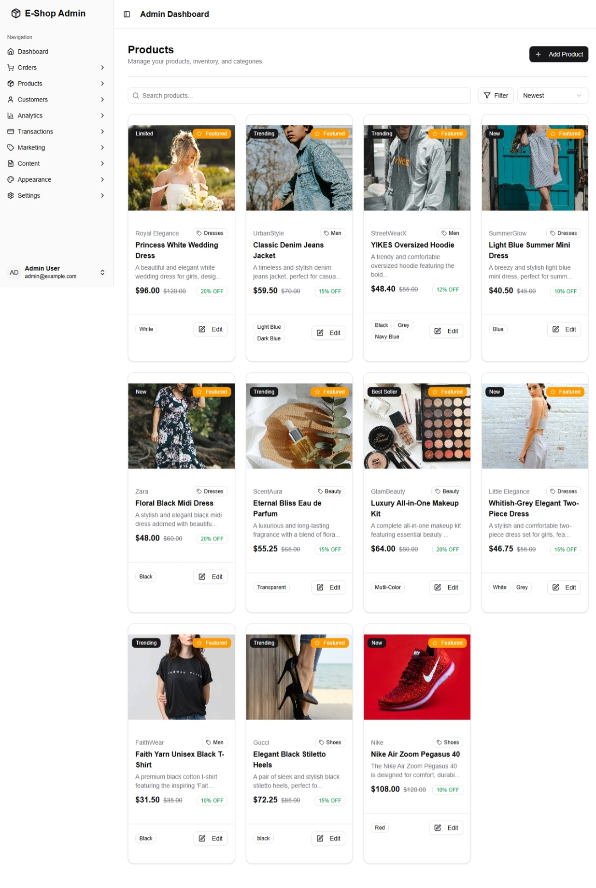

### Admin Add Product

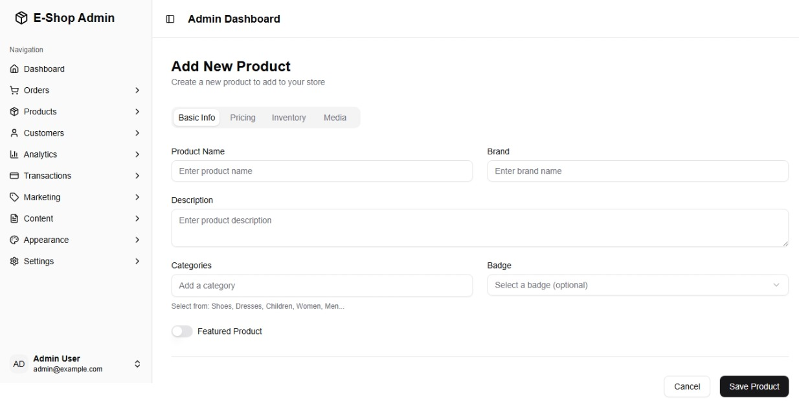

### Admin Customer Management

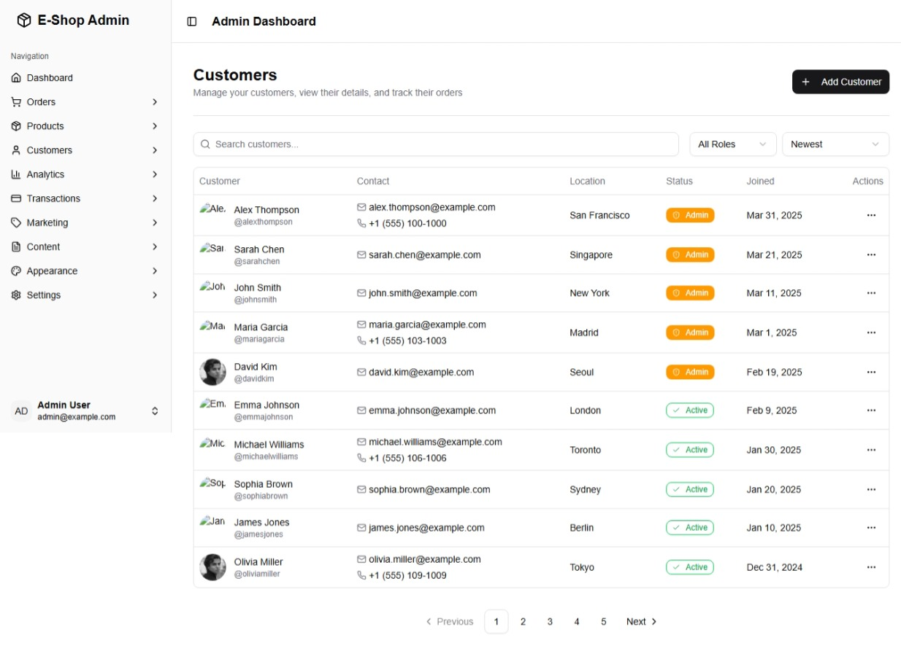
